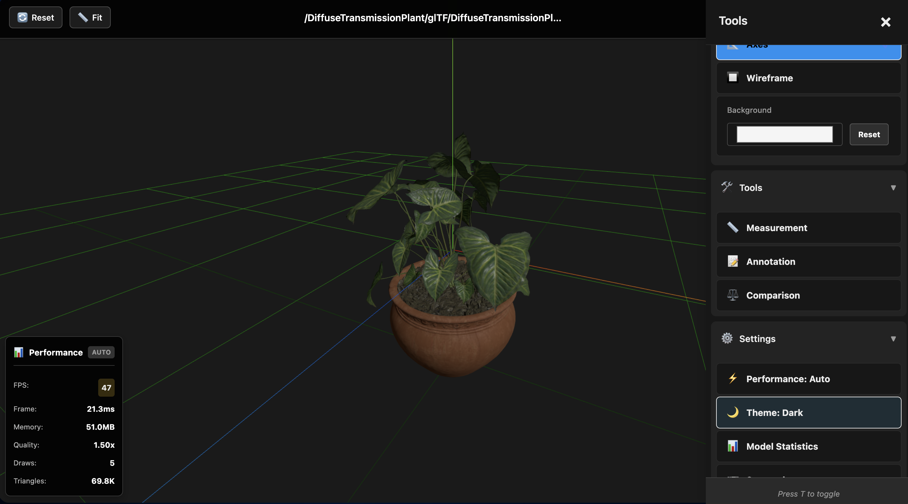

# 3D Viewer for Nextcloud

[](https://github.com/maz1987in/3Dviewer-Nextcloud/releases)
[](LICENSE)
[](https://nextcloud.com)

A comprehensive 3D model viewer application for Nextcloud that supports multiple 3D file formats with advanced features like dynamic grid sizing, model comparison, and real-time streaming.

## 📸 Screenshots

<table>
  <tr>
    <td align="center">
      <br/>
      <b>Main Viewer Interface</b><br/>
      Interactive 3D model viewing with intuitive controls
    </td>
    <td align="center">
      <br/>
      <b>Nextcloud Files Integration</b><br/>
      Seamlessly integrated with the Files app
    </td>
  </tr>
  <tr>
    <td align="center">
      <br/>
      <b>Rich Toolbar Features</b><br/>
      Grid, axes, wireframe, background controls and more
    </td>
    <td align="center">
      <br/>
      <b>Multi-File Support</b><br/>
      OBJ+MTL+textures, GLTF+bins+images
    </td>
  </tr>
  <tr>
    <td align="center" colspan="2">
      <br/>
      <b>Dark Theme Support</b><br/>
      Automatically adapts to Nextcloud theme
    </td>
  </tr>
</table>

## 📚 Documentation

- **[User Guide](docs/README.md)** - Complete installation, usage, and feature documentation
- **[Technical Documentation](docs/TECHNICAL.md)** - Architecture, API, and implementation details
- **[Troubleshooting Guide](docs/TROUBLESHOOTING.md)** - Common issues and solutions
- **[Testing Guide](docs/TESTING.md)** - Testing procedures and guidelines
- **[Contributing Guide](CONTRIBUTING.md)** - How to contribute to the project

## ✨ Key Features

- **Multi-Format Support** - GLB, GLTF, OBJ (+MTL), STL, PLY, FBX, 3MF, 3DS, DAE, X3D, VRML
- **Multi-File Models** - Full support for OBJ+MTL+textures and GLTF+bins+images
- **Dynamic Grid System** - Automatically adapts to model size and position
- **Model Comparison** - Side-by-side model viewing with synchronized controls
- **Advanced Tooling** - Annotations, measurements, and analysis tools
- **3D Camera Controller** - Intuitive circular controller for precise camera navigation
- **Face Labels** - Orientation markers (TOP, BOTTOM, FRONT, BACK, LEFT, RIGHT) on model faces
- **Export Functionality** - Export models to GLB, STL, and OBJ formats
- **Camera Projection Toggle** - Switch between perspective and orthographic views
- **Progressive Texture Loading** - Background loading for improved performance
- **Dependency Caching** - IndexedDB caching for faster multi-file model loading
- **Model Statistics Panel** - Detailed information about loaded models
- **Help Panel** - Comprehensive in-app documentation and controls guide
- **Performance Optimized** - Code splitting, dynamic imports, and quality modes with visual overlay
- **Theme Integration** - Respects Nextcloud light/dark themes with RTL support
- **Accessibility** - ARIA labels and keyboard navigation
- **Compression Support** - DRACO geometry and KTX2/Basis texture compression

## 🚀 Quick Start

### Installation

#### From Nextcloud App Store (Recommended)

1. Open your Nextcloud instance
2. Go to **Apps** (top-right menu)
3. Search for "**3D Viewer**"
4. Click **Download and enable**

MIME types are registered automatically during installation!

#### Manual Installation

```bash
# Clone or download the app
git clone https://github.com/maz1987in/3Dviewer-Nextcloud.git
cd 3Dviewer-Nextcloud

# Install dependencies and build
composer install --no-dev
npm install
npm run build

# Deploy to Nextcloud
cp -r . /path/to/nextcloud/apps/threedviewer/

# Enable the app
php occ app:enable threedviewer
```

**Post-Installation:** If you uploaded 3D files before installing the app, rescan them:

```bash
php occ files:scan --all
```

### Basic Usage

1. **Upload** 3D files to your Nextcloud Files
2. **Click** on any 3D file (`.glb`, `.gltf`, `.obj`, `.stl`, etc.)
3. **Navigate** using mouse/touch:
   - **Rotate**: Left click + drag (or one finger)
   - **Zoom**: Mouse wheel (or pinch)
   - **Pan**: Right click + drag (or two fingers)
   - **Reset**: Double-click (or double-tap)

For detailed usage instructions, see the [User Guide](docs/README.md).

## 📦 Supported Formats

### 3D Model Formats

| Format | Extension | Multi-file Support | Notes |
|--------|-----------|-------------------|-------|
| GLTF   | `.gltf`, `.glb` | Yes (bins, images) | Preferred format, full support |
| OBJ    | `.obj`    | Yes (MTL, textures) | Requires MTL for materials |
| STL    | `.stl`    | No | 3D printing format |
| PLY    | `.ply`    | No | Point cloud support |
| FBX    | `.fbx`    | Limited | Autodesk format |
| DAE    | `.dae`    | Limited | Collada format |
| 3DS    | `.3ds`    | Limited | 3D Studio format |
| 3MF    | `.3mf`    | No | 3D Manufacturing format |
| X3D    | `.x3d`    | Limited | Web3D standard |
| VRML   | `.wrl`, `.vrml` | Limited | Legacy format |

### Supporting File Types

**Material & Dependency Files:**
- `.mtl` - Material definitions for OBJ files
- `.bin` - Binary data for GLTF models

**Texture Formats** (for multi-file models):
- `.png`, `.jpg`/`.jpeg` - Standard web formats
- `.tga` - Targa image format
- `.bmp` - Bitmap format
- `.webp` - Modern web format

> **Note**: Supporting files (MTL, BIN, textures) are automatically loaded when present in the same directory as the main model file.

## 🤝 Contributing

Contributions are welcome! Please see our [Contributing Guide](CONTRIBUTING.md) for:
- Code standards and best practices
- Development environment setup
- Pull request process
- Testing requirements

## 📄 License

Copyright © 2025 Mazin Al Saadi. Licensed under AGPL-3.0-or-later.

This project is licensed under the **AGPL-3.0 License**. See [LICENSE](LICENSE) for details.

## 🔗 Links

- **GitHub**: [github.com/maz1987in/3Dviewer-Nextcloud](https://github.com/maz1987in/3Dviewer-Nextcloud)
- **Changelog**: [CHANGELOG.md](CHANGELOG.md)
- **Issues**: [GitHub Issues](https://github.com/maz1987in/3Dviewer-Nextcloud/issues)
- **Discussions**: [GitHub Discussions](https://github.com/maz1987in/3Dviewer-Nextcloud/discussions)

## 📊 Version

**Current Version**: 1.7.12  
**Released**: January 4, 2025

See [CHANGELOG.md](CHANGELOG.md) for detailed release notes and version history.

---

For detailed technical information, API documentation, and architecture details, see the [Technical Documentation](docs/TECHNICAL.md).
